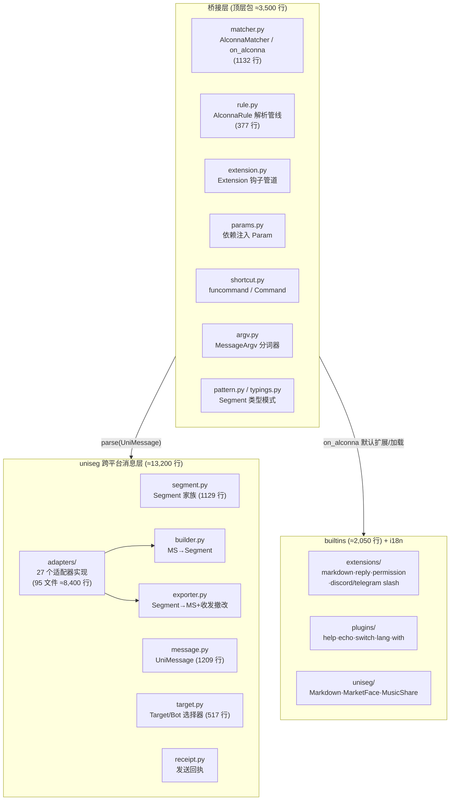
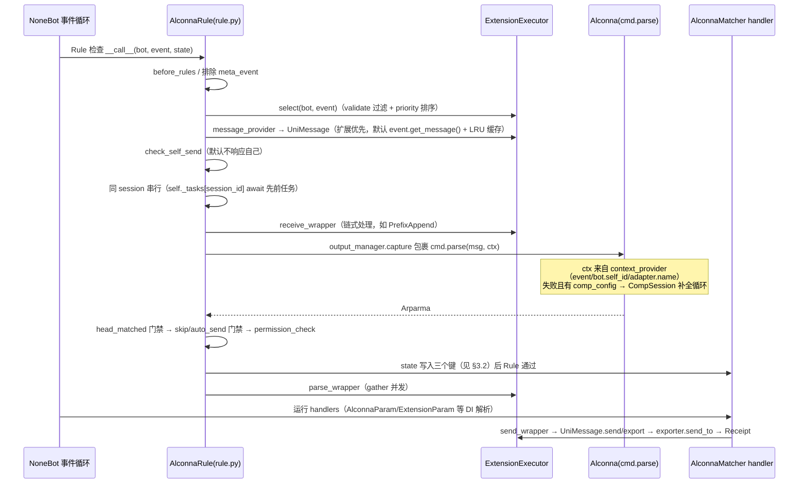
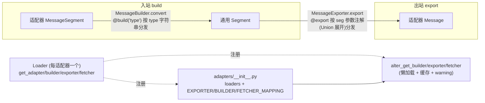

# nonebot-plugin-alconna 学习笔记

> 基于 `C:\Users\Administrator\Project\plugin-alconna` 仓库（版本 **0.62.1**，src 布局）的系统性源码学习笔记。
> 依赖版本：arclet-alconna 1.8.44 / nepattern 0.7.8 / nonebot2 >= 2.5.0 / Python >= 3.10。
>
> 本笔记结构：总体架构 → 快速上手配方 → 核心链路（消息处理全数据流）→ uniseg 跨平台消息架构 → 扩展体系 → 内置组件 →
> 配置与模块地图 → arclet-alconna 本体速查 → 测试与调试。

---

## 1. 插件定位与总体架构

`nonebot-plugin-alconna` 做两件事：

1. **命令解析桥接**：把 [arclet-alconna](https://github.com/ArcletProject/Alconna) 命令解析器接入 NoneBot2 事件系统，提供
   `on_alconna()` 事件响应器与一整套依赖注入；
2. **跨平台消息抽象（uniseg）**：提供 `UniMessage` / `Target` / `Receipt` 等通用消息模型，用 builder/exporter 双向转换抹平
   **27 个适配器** 的消息段差异，实现"一次编写、处处收发"。

### 1.1 三层结构（约 19,000 行）



### 1.2 插件加载流程（`__init__.py`）

- `nonebot.load_plugin("nonebot_plugin_alconna.uniseg")` 先把 uniseg 作为 **子插件**加载（
  `src/nonebot_plugin_alconna/__init__.py:5`）；
- 顶层再 re-export 全部符号：Alconna 全家桶、matcher/rule/params/extension/shortcut、uniseg 全部类型；
- 模块加载尾部（`__init__.py:191-203`，包在 `contextlib.suppress(ValueError, LookupError)` 里以兼容无 driver 环境）依次应用配置：
  `alconna_global_extensions` → `load_from_path()`；`alconna_apply_filehost` → `apply_filehost()`；
  `alconna_enable_saa_patch` → `patch_saa()`；`alconna_apply_fetch_targets` → `apply_fetch_targets()`；
  `alconna_builtin_plugins` → `load_builtin_plugins(...)`。
- `load_builtin_plugin(s)` 从 `nonebot_plugin_alconna.builtins.plugins.<name>` 加载子插件并缓存。

### 1.3 版本演进要点（读旧文档时注意）

- 本版本（0.62.x）把原独立插件 `nonebot-plugin-uniseg` **内置**为 `uniseg` 子包；旧 API 如 `Arparat`、`AlconnaMatchs` 已改名为
  `AlconnaResult`、`AlconnaMatches`；
- 文档中 `from nonebot_plugin_alconna.adapters.onebot11 import Image` 的 **适配器专属段落标注已移除**——现在统一用 uniseg
  通用段（`from nonebot_plugin_alconna import At, Image`）；adapter 目录下 `__init__.py` 只保留 `Loader`；
- `typings.py` 中的 `SegmentPattern` / `TextSegmentPattern` 仍保留，供第三方写适配器专属标注使用。

---

## 2. 快速上手：典型使用配方

### 2.1 定义命令响应器

```python
from arclet.alconna import Alconna, Args, Option, Subcommand, CommandMeta
from nonebot_plugin_alconna import on_alconna

pip_cmd = on_alconna(
    Alconna(
        "pip",
        Subcommand("install", Args["pak", str], Option("--upgrade|-U")),
        Subcommand("list", Option("--out-dated")),
        meta=CommandMeta(description="pip 命令"),
    ),
    skip_for_unmatch=True,      # 解析失败时跳过该响应器
    auto_send_output=True,      # 自动发送帮助/错误输出
    aliases={"p"},              # 别名（内部注册为 prefix shortcut）
    comp_config={"tab": "切换", "enter": "确认", "exit": "退出", "timeout": 30},  # 补全会话
    use_cmd_start=False,        # 是否把 nb 的 COMMAND_START 并入命令前缀
    use_cmd_sep=False,          # 是否把 COMMAND_SEP 并入分隔符
    use_origin=False,           # 是否用未经 to_me 处理的原始消息
    extensions=[...],           # 匹配扩展（类或实例）
    exclude_ext=[...],          # 排除扩展（id 以 "!" 开头的不可排除）
    block=True, priority=1,     # 标准 nonebot 参数
)
```

`command` 传字符串时经 `AlconnaFormat(command, union=False)` 转为 Alconna（`matcher.py:1003`）。

**skip_for_unmatch × auto_send_output 行为矩阵**：

| skip \ auto | True                       | False                                        |
|-------------|----------------------------|----------------------------------------------|
| True        | 帮助文本自动发送           | 帮助文本不发送                               |
| False       | 帮助文本和错误信息自动发送 | 输出写入 `CommandResult.output` 交给 handler |

### 2.2 handler 中取解析结果（依赖注入）

```python
from nonebot_plugin_alconna import (
    AlconnaMatches, AlconnaResult, AlconnaMatch, AlconnaQuery, AlcResult, AlcMatches,
    CommandResult, Match, Query,
)
from arclet.alconna import Arparma, Alconna, Duplication

@pip_cmd.handle()
async def h1(res: CommandResult): ...        # 或 res: AlcResult = AlconnaResult()

@pip_cmd.handle()
async def h2(arp: Arparma): ...              # 或 arp: AlcMatches = AlconnaMatches()

@pip_cmd.handle()
async def h3(pak: Match[str]): ...           # Match 也可省 DI 函数；available/result

@pip_cmd.handle()
async def h4(u: Query[bool] = Query("install.upgrade.value", False)): ...

@pip_cmd.handle()
async def h5(pak: str): ...                  # 直接写参数名：按 got_path 键 → all_matched_args → "{name}.value" 顺序解析（见 §3.4）
```

DI 一览（`params.py`）：

| 依赖函数 / 注解                                                    | 返回            | 说明                                                |
|--------------------------------------------------------------------|-----------------|-----------------------------------------------------|
| `AlconnaResult()` / `AlcResult`                                    | `CommandResult` | `{result: Arparma, output: str                      |None}`，含 `.matched/.source/.context` |
| `AlconnaMatches()` / `AlcMatches`                                  | `Arparma`       | 原始解析结果                                        |
| `AlconnaMatch(name, middleware)`                                   | `Match[T]`      | `all_matched_args` 中的参数，middleware 可后处理    |
| `AlconnaQuery(path, default, middleware)` / `Query(path, default)` | `Query[T]`      | 按 path 查询 Arparma                                |
| `AlconnaDuplication([T])`                                          | `Duplication`   | 未指定类型时动态生成                                |
| `AlconnaExecResult()` / `AlcExecResult`                            | `dict`          | 命令绑定 action 的返回值集                          |
| `AlconnaArg(path)`                                                 | Any             | `got_path` 存储的参数（`state["_alc_arg_{path}"]`） |
| `AlconnaExtension(T)`                                              | T \| None       | 从本次选中的扩展里取指定类型实例                    |
| `AlconnaContext()`                                                 | dict            | parse 时注入的上下文                                |

### 2.3 条件分派：assign / dispatch

```python
@pip_cmd.assign("install")                    # 仅 pip install xxx
@pip_cmd.assign("install.pak", "nb")          # 仅 pak == "nb"
@pip_cmd.assign("list", or_not=True)          # list 或 $main（无选项/子命令命中）
async def ...(res: CommandResult = AlconnaResult()): ...

child = pip_cmd.dispatch("install")           # 生成独立子 matcher（priority=父+1），共享 rule/executor
@child.assign("~upgrade")                     # "~X" 展开为父级 basepath + ".X"
async def ...(pak: Query[str] = Query("~pak")): ...
```

- `assign` 是 `@handle([Check(assign(...))])` 的语法糖（`matcher.py:278`）；`Check` 失败时 `matcher.skip()`（
  `params.py:197`）。
- `"$main"` 表示"没有任何选项/子命令被匹配"（`params.py:144`）。
- `dispatch` 在父 matcher 上挂一个 `_Dispatch` handler 记录解析结果，再创建一个 rule 追加 `Rule(fn)` 的新
  matcher，命中时把结果写入其 `state["_alc_result"]`（`params.py:332-353`）。

### 2.4 多轮获取参数：got / got_path

```python
from nonebot_plugin_alconna import AlconnaMatcher, UniMessage, At

test_cmd = on_alconna(Alconna("test", Args["target?", [str, At]]))

@test_cmd.handle()
async def h(m: AlconnaMatcher, target: Match[str | At]):
    if target.available:
        m.set_path_arg("target", target.result)   # 写入 state["_alc_arg_target"]

@test_cmd.got_path("target", prompt="请输入目标")  # Arg 未提供时发 prompt 并等待下一条消息
async def g(target: str | At):
    await test_cmd.send(UniMessage(["ok\n", target]))
```

`got_path` 的验证逻辑（`matcher.py:584-626`）：取新消息的 `msg[0]`（首个消息段；`_AllParamPattern`（`alias == "*"`）时逐段过滤验证），用
Arg 的 pattern `_validate()`：

- `ANY` → 原样返回 Segment；`AnyString`/`STRING` 且是文本 → 转 `str`；否则用 pattern 校验文本段；
- 失败 → `reject(prompt)` 重问；成功 → 可选 `middleware(event, bot, state, res)` 后 `set_path_arg`。

`matcher.got(key, prompt)` 则是 NoneBot 风格，把整个新消息 `export` 后 `set_arg`。所有 prompt/finish/reject 均支持
`UniMessage`/模板/`Segment`。

### 2.5 跨平台收发消息

```python
from nonebot_plugin_alconna import UniMessage, Target, SupportScope, message_recall, MsgId, MsgTarget

# 被动回复（在 handler 内，从上下文取 event/bot）
receipt = await UniMessage.image(path="test.png").send(at_sender=True, reply_to=True)
if receipt.recallable:
    await receipt.reply("10 秒后撤回")
    await receipt.recall(delay=10, index=0)

# 主动推送（无上下文，Target 自动选择可用 Bot）
await Target.group("123456789", SupportScope.qq_client).send(UniMessage.text("hello"))

# 撤回当前会话消息
await message_recall()
```

`send()` 关键参数：`target`(Event|Target)、`bot`、`fallback`(bool|FallbackStrategy)、`at_sender`、`reply_to`
(True=回复当前消息/str=指定 id/Reply 对象)。发送细节见 §4.6。

### 2.6 消息模板与 i18n

```python
msg = UniMessage.template("{:At(user, $event.get_user_id())} 已确认目标为 {target}")
# "{:Type(args)}" 构造段；"$xxx.yyy" 从格式化 kwargs 里取值并沿属性路由取值
# 特殊注入：$event / $target / $message_id（AlconnaMatcher.convert 内补充，matcher.py:659-681）

i18n_msg = matcher.i18n("nbp-alc", "some_key", name="x")   # UniMessage.i18n + 状态插值
```

### 2.7 funcommand 与 Command（Koishi 风格）

```python
from nonebot_plugin_alconna import funcommand, Command

@funcommand()                        # 函数签名 → Args；返回值自动发送
async def calc(op: Literal["add"], a: float, b: float): return f"{a+b}"

book = (
    Command("book", "测试")
    .option("writer", "-w <id:int>")
    .usage("book [-w <id:int>]")
    .shortcut("测试", {"args": ["--anonymous"]})
    .action(lambda options: str(options))   # action 返回值自动发送（fallback=rollback）
    .build()
)
```

`Command` 继承 `AlconnaString`，`build()` 从 buffer 组装 `Alconna`、绑定 actions、调用 `on_alconna`、注册 shortcuts（
`shortcut.py:105-151`）。还支持 `command_from_json/yaml`（`CommandModel`，actions 里可内嵌 `exec` 生成的异步函数）。

### 2.8 快捷指令

```python
pip_cmd.shortcut("涩图(\\d+)张", {"args": ["{0}"]})            # 正则 key + 捕获组占位
setu.shortcut(r"(?:来|抽)(点|\d*)张(.+?)涩图",
    command="setu {0}", arguments=["tags", "{1}"],
    fuzzy=True, wrapper=my_wrapper)                            # wrapper(slot, content, context) 改写槽值
hd = on_alconna(...).test("请求处理 -fa 1234", {"id": "1234"}) # 启动期声明式测试（driver.on_startup 执行）
```

内置 `--shortcut` 选项可运行时增删查快捷指令（配合 `SuperUserShortcutExtension` 限超级用户）。

---

## 3. 核心链路：一条消息的完整生命周期

### 3.1 全链路序列图



对应实现：`rule.py:292-366`（`__call__`）、`rule.py:230-290`（`handle` 含补全会话）、`extension.py:182-266`（SelectedExtensions
各钩子）。

### 3.2 关键 state 键（consts.py / constraint.py）

| state 键                                        | 写入者                      | 内容                                     |
|-------------------------------------------------|-----------------------------|------------------------------------------|
| `_alc_result`                                   | rule.py:360                 | `CommandResult(result=Arparma, output)`  |
| `_alc_exec_result`                              | rule.py:361                 | `cmd.exec_result`（action 返回值 dict）  |
| `_alc_extension`                                | rule.py:362                 | `SelectedExtensions`（本次选中的扩展链） |
| `_alc_arg_{path}`                               | set_path_arg                | `got_path` 验证后的参数                  |
| `_alc_arg_keys`                                 | set_path_arg                | 已设置的 path 列表                       |
| `_alc_uniseg_message`                           | rule.py:323 / uniseg params | 当前 `UniMessage`（UniMsg DI 优先读它）  |
| `_alc_uniseg_target` / `_alc_uniseg_message_id` | uniseg/params.py            | 缓存的 Target / 消息 id                  |

### 3.3 on_alconna 的组装（matcher.py:955-1112）

1. 字符串命令 → `AlconnaFormat`；
2. **命令冲突处理**（`alconna_conflict_resolver`）：`raise` 抛错 / `ignore` 删新命令返回旧 matcher / `replace` 清理旧
   matcher / `default` 合并 formatter；
3. 给 `Rule.HANDLER_PARAM_TYPES` 与 matcher 的 `HANDLER_PARAM_TYPES` 注入 `StackParam`、`DependencyCacheParam`、
   `AlconnaParam`（Rule 上还加 `ExtensionParam.new(executor)` 动态子类，实现"不同 matcher 的扩展互不串扰"，
   `params.py:215-241`）；
4. `type()` 动态生成 `AlconnaMatcher` 子类，注册进 `matchers[priority]`；
5. `command.meta.extra` 写入 `matcher.source/position`，并以 **weakref.KeyedRef** 存 `matcher`（GC 后自动清理，供
   `referent(cmd)` 反查）；
6. `driver.on_startup(matcher._run_tests)` 注册声明式测试。

`AlconnaRule.__init__`（rule.py:81-158）同时完成配置归并：`alconna_global_completion`（当 comp_config 为空 dict
时接管）、auto_send/response_self/use_cmd_start 等三级默认（显式参数 > 插件配置）；`use_cmd_start` 时把 `COMMAND_START` 并入
`command.prefixes`（若命令无名则首个 prefix 升格为命令名、其余转为 prefix-shortcut）；`command` 以 **weakref** 持有并在回收后尝试从
`command_manager` 重解析。

### 3.4 依赖注入解析规则（AlconnaParam._solve，params.py:280-329）

handler 形参按以下优先级解析：

1. 注解为 `CommandResult` / `Arparma` / `Alconna` / `Duplication(子类)` / `SelectedExtensions` / `Extension子类` → 直接映射；
2. 注解 `Match` → `all_matched_args[name]`；默认值是 `Query` 实例 → 按 path 查询（`~` 前缀拼接 basepath）；
3. 名为 `ctx`/`context` 且注解 dict → `Arparma.context`；
4. **裸参数名兜底**：`_alc_arg_keys` 中的 got_path 键（全等或 `.name` 后缀匹配）→ `all_matched_args[name]` →
   `query("{name}.value")`（选项值）→ 默认值 / `PydanticUndefined`（跳过 handler）。

### 3.5 发送链路（AlconnaMatcher.send → Receipt）

`matcher.py:713-734` + `message.py:1083-1136`：

```
AlconnaMatcher.send(message, fallback)
  → convert(message)          # MessageTemplate/UniMessageTemplate 格式化（含 $event/$target/$message_id、path 参数）
  → executor.send_wrapper     # 扩展链式包装
  → UniMessage.send(target=event, no_wrapper=True)   # 已包装过，不再走 current_send_wrapper
      → at_sender / reply_to 插段（非私聊才插 At）
      → export(bot, fallback)  # exporter 分发 + 回退策略（§4.5）
      → exporter.send_to(target, bot, msg)           # 适配器实际 API
      → Receipt(bot, target, exporter, msg_ids, UniMessage)
```

`AlconnaMatcher.ensure_context`（matcher.py:940-952）在 matcher 运行期把 `current_send_wrapper` 设为
`executor.send_wrapper`，因此普通 `matcher.send()` / `UniMessage.send()` 也会经过扩展包装。

### 3.6 补全会话（CompSession）机制

`rule.py:230-290`：`comp_config` 存在且首解析失败时，用 `with CompSession(cmd):` 捕获 `PauseTriggered`，然后基于
`nonebot_plugin_waiter` 建立同 session 会话：

- 控制指令默认 `.tab`（切换建议）/`.enter`（确认输入）/`.exit`（退出），可由 CompConfig 改名、`disables`/`hides` 控制、`lite`
  隐藏全部提示；
- waiter 返回 `int` → `interface.tab(n)` 刷新建议；`True` → enter (None)；其余内容 → `interface.enter(content)` 重新解析；
- 超时/退出返回带 `SpecialOptionTriggered("completion")` 的失败 Arparma；成功则返回真实结果。

### 3.7 值得注意的实现细节

- **同 session 串行**：`rule.py:314-315` 对同一 `session_id` 的解析任务用 `self._tasks` 排队 await，避免补全会话并发竞争；
- `Arparma._additional.update(bot=..., event=..., state=...)`（rule.py:322）让 `arp.call(target)` 绑定 action 时能注入
  bot/event/state；
- `context_provider` 中 `hasattr("bot", "platform")` 是对字符串取属性（恒 False），`bot.platform` 恒不会被写入 ctx —— 疑似
  `getattr(bot, "platform", None)` 的笔误（extension.py:238）；
- 文档称 `got_path` "获取最后一个消息段"，代码实际取 `msg[0]`（首个非空白段，matcher.py:610-613）——以代码为准；
- `on_alconna` 会 patch 全局 `Rule.HANDLER_PARAM_TYPES`（matcher.py:1022），因此普通 matcher 的 rule 依赖也支持这些 Param。

---

## 4. uniseg：跨平台消息架构

### 4.1 Segment 家族（segment.py）

```
Segment (dataclass: origin=原始 MS, _children)
├── Text(text, styles: dict[(start,end), list[str]])   # 富文本：mark/bold/italic/link/color...，
│                                                      # __str__ 渲染 <bold>..</bold>，__rich__ 渲染 ANSI
├── At(flag: user|role|channel, target, display)
├── AtAll(here)
├── Emoji(id, name, url)
├── Media(id, url, path, raw, mimetype, name)          # raw_bytes 用 fleep 嗅探 mime；save() 落盘 localstore
│   ├── Image(width, height, sticker)
│   ├── Audio / Voice / Video(thumbnail) / File
├── Reply(id, msg, origin)                             # 回复
├── Reference(id, nodes)                               # 转发消息；children = RefNode|CustomNode
├── Hyper(format: xml|json, raw, content)              # 卡片；json 自动 raw↔content 同步
├── Button(flag: action|link|input|enter, label, ...)  # children[0] = label Text
├── Keyboard(buttons, id, row)                         # children = Buttons
├── Other(origin)                                      # 未知段原样透传（dump 记录 module/class 可重建）
└── I18n(LangItem, args, kwargs)                       # 发送时经 tarina lang 解析
```

- `dump()/load()`：JSON 序列化往返（`get_segment_class` 按类名小写递归找子类）；
- **custom 扩展点**（`_CustomMounter`，segment.py:1046-1111）：`@custom_register(MySeg, "adapter_seg_type"|predicate)`
  注册入站转换；`@custom_handler(MySeg)` 注册出站转换 —— 第三方增加自定义 Segment 无需改 builder/exporter；
- `env = create_local_patterns("nonebot")`：nepattern 本地类型环境，注册 `Segment`/`Media`（KEEP 模式）与 `Text`（带样式还原的
  `_Text` 模式，argv.py:130），因此 **Segment 类可直接作为 Args 的类型标注**。

### 4.2 UniMessage（message.py）

- `list[Segment]` 子类，文本自动合并（`__merge_text__`）；str/Segment/UniMessage 之间任意 `+`；
- 类型索引：`msg[At]`（全部）/ `msg[At, 0]`（第 n 个）/ `msg[Text, 0:2]`（切片）；`has/include/exclude/get/index/count/only`；
- 文本操作（样式感知）：`extract_plain_text / split / replace / startswith / endswith / removeprefix/suffix / strip`；
- `transform(rules)` / `transform_async`：按 `{seg_type: False|Segment|[...]|callable}` 规则重写消息；`select(cls)` 递归收集（含
  children）；`filter/map/join/copy`；
- `dump()/load()`；`download(stream)` 用 driver HTTP 客户端把 Media.url 拉回 raw；
- `_method` 描述符实现 **类/实例双态构造器**：`UniMessage.image(...)` 新建，`msg.image(...)` 追加。

### 4.3 双向转换：Builder / Exporter / Loader



- **Builder**（builder.py）：`__init__` 扫描类上带 `__build_target__` 的方法建映射；`convert()` 流程：映射命中（返回 None
  视为未处理）→ `custom.solve` → `wildcard_build` → `Other(seg)`；文本段自动转 `Text`（带 styles 或以 type 名 mark 样式）；
  `preprocess` 钩子可预处理整条消息；`extract_reply` 从事件对象抽取回复（如 OB11 的 `event.reply`）。
- **Exporter**（exporter.py）：除 `@export` 分发外，还承担 `get_message_type/get_message_id/get_target/send_to`（抽象）与
  `recall/edit/reaction/get_reply`（可选覆盖，覆盖与否决定 Receipt 能力探测）。
- **注册与分发**（adapters/ __init__.py）：import 时扫描目录 + `n-p-alc.uniseg.adapters` entry point 装载全部 Loader →
  `loaders`；只对 **当前运行中的适配器**实例化三个 MAPPING（`PLUGIN_ALCONNA_TESTENV=1` 时全量装）；`alter_get_*` 提供懒加载兜底。

### 4.4 Target 与 Bot 选择（target.py）

- `Target(id, parent_id, channel, private, source, self_id, extra)`；构造器 `Target.group/channel_/user`；
- `extra` 存 `scope`（SupportScope，平台维度）/ `adapter`（SupportAdapter 值）/ `platforms`；
- **selector 组合**：`scope` 选择器（`SCOPES` 注册表，`@_register(SupportScope.xxx)`）∧ 用户 selector ∧ adapter/platform
  谓词，层层包裹；默认 `_cache_selector` 查询 `TARGET_RECORD`（fetch_targets 缓存）；
- `SupportScope` 与适配器解耦是关键设计：如 `qq_client` 可由 OB11/OB12/Mirai/Red/Satori (chronocat 等 platform)
  /Kritor/Milky 任一适配器承载，`select_qq_client` 会检查 `bot.platform` 细分；
- `select()`：优先 `self_id` 定位，否则 `get_bot(predicate=selector, rand=True)`；
- `TargetFetcher`：抽象 `fetch(bot)` 枚举 Target；`refresh` 按 self_id 缓存；`get_selector` 生成"成员校验 + 10 分钟 TTL
  过期重拉"的选择器；`apply_fetch_targets()` 挂 `on_bot_connect/disconnect` 钩子维护 `TARGET_RECORD`。

### 4.5 回退策略（fallback.py + exporter._auto_fallback）

出站转换失败时逐级尝试（exporter.py:179-232）：

1. `@export` 映射（方法抛 `SerializeFailed/NotImplementedError` 视为失败）→ `custom.export` → `Other` 原样透传 → nonebug
   fake 适配器直接 `str(seg)`；
2. `FallbackStrategy`：`ignore`(丢弃) / `to_text`(转文本) / `rollback`(从 children 提取可发送段，Reference 特判逐节点) /
   `forbid`(抛 SerializeFailed) / `auto`(`_auto_fallback` 智能降级：Media 带 url → `[image]url`、可 to_url
   则上传后降级、At → `@display`、Reply → `> 回复...`、Keyboard→子按钮降级等)；
3. `fallback=True`（布尔）等价 auto；整个 export 彻底失败时返回 `FallbackMessage(str(self))`（一个最小 NoneBot Message
   实现，保证总能发出去）。

### 4.6 UniMessage.send () 全流程（message.py:1083-1136）

1. target 默认 `current_event`；bot：Target → `target.select()`，Event → `current_bot`；
2. `at_sender`：非私聊在头部插 `At("user", ...)`；`reply_to`：True→当前消息 id、str→指定 id、Reply→原对象，头部插 `Reply`；
3. target 为 Event 且存在 `current_send_wrapper`（AlconnaMatcher 上下文中即 executor.send_wrapper）且未 `no_wrapper` →
   先包装；
4. `export(bot, fallback)`（含 I18n 段解析，注入 `$event/$target/$message_id`）；
5. `exporter.send_to(target, bot, msg, **kwargs)` —— 适配器自定义（Event 直接 bot.send；Target 转换后调 API，如 OB11
   `send_msg(message_type=...)`、转发消息走 `send_*_forward_msg`、文件走 `upload_*_file`）；
6. 返回 `Receipt`。

### 4.7 Receipt（receipt.py）

`receipt = (bot, context, exporter, msg_ids, uni_factory)`；能力探测 `recallable/editable/reactionable` = exporter
是否覆盖了对应基类方法；`recall(delay, index)`（全部/单条，成功后清 msg_ids）、`edit(message)`（新 id 替换）、
`reaction(emoji, delete)`、`get_reply(index)`、`send/reply/finish`（链式发送累计 msg_ids）。

### 4.8 上下文工具与 DI（functions.py / params.py / rule.py / tools.py）

- `get_message_id(event, bot)`（结果缓存在 `event.__uniseg_message_id__`）、`get_target`、`message_recall/edit/reaction`：都从
  `current_event/current_bot` 兜底，按 adapter 分发到 exporter；
- DI：`UniMsg`/`OriginalUniMsg`（优先读 state 的 `_alc_uniseg_message`）、`MsgTarget`、`MsgId`、`UniversalSegment(t, index)`；
- `at_me(only_at)` / `at_in(*ids)` 规则：剥掉头部 Reply 后检查首段 At；QQ 官方 API 群聊会吞 At，这里做了补插特判（rule.py:
  53-54）；
- `image_fetch(event, bot, state, img)` 中间件：raw→path→Red 专有 download→url 直下→OB11 `get_image`→OB12 `get_file`
  →Mirai URL 拼接→TG `get_file`→飞书 `get_msg_resource`；
- `get_bot(adapter=, bot_id=, index=, rand=, predicate=)`：通用 Bot 检索。

### 4.9 兼容补丁（uniseg/utils/）

| 函数                   | 作用                                                                                                 | 恢复         |
|------------------------|------------------------------------------------------------------------------------------------------|--------------|
| `patch_matcher_send()` | 替换全局 `Matcher.send` 为支持 str/MS/MessageTemplate → UniMessage（fallback=to_text）的版本         | 返回 dispose |
| `apply_filehost()`     | `Media.to_url = FileHost(...).to_url`（需 nonebot_plugin_filehost），auto 回退可上传 raw/path 换 URL | 返回 dispose |
| `patch_saa()`          | 替换 SAA `MessageFactory.send`：原生失败时转 UniMessage 发送，返回 `UnisegReceipt`（支持 revoke）    | 返回 dispose |

---

## 5. 扩展体系（extension.py）

### 5.1 Extension 钩子

| 钩子                                                           | 签名               | 语义 / 默认                                                                |
|----------------------------------------------------------------|--------------------|----------------------------------------------------------------------------|
| `priority` / `id` (抽象)                                       | property           | 排序权重（小者优先）；`id` 以 `!` 开头表示不可被 exclude                   |
| `namespace`                                                    | property           | 非空时仅作用于同 namespace 的命令                                          |
| `validate(bot, event)`                                         | → bool             | 默认 `event.get_type() == "message"`；select 时过滤                        |
| `message_provider(event, state, bot, use_origin)`              | → UniMessage\|None | 自定义取消息（如从非消息事件合成命令）；**首个非 None 生效**               |
| `receive_wrapper(bot, event, cmd, receive)`                    | → UniMessage       | 入站消息链式加工（如 LLM 翻译、前缀追加）                                  |
| `context_provider(ctx, event, bot, state)`                     | → dict             | 加工 parse 上下文，最后统一补 event/bot.self_id/adapter.name               |
| `permission_check(bot, event, medium: Arparma                  | CompSession)`      | → bool                                                                     | 头部匹配后、执行前的权限门禁（任一 False 则拒） |
| `parse_wrapper(bot, state, event, res)`                        | None               | 解析完成后的并发后处理（asyncio.gather）                                   |
| `output_converter(output_type, content)`                       | → UniMessage       | help/shortcut/completion/error 四类输出的格式化；首个成功者生效            |
| `send_wrapper(bot, event, send)`                               | → 同类型           | 发送前链式加工                                                             |
| `before_catch(name, annotation, default)` + `catch(Interface)` | 任意               | 自定义依赖注入（配合 `ExtensionParam`）                                    |
| `post_init(alc)`                                               | None               | 响应器创建后对命令对象的后处理                                             |
| `inject(dependent)` (final)                                    | 任意               | 扩展内部复用 NoneBot DI（支持 Dependent/DependsInner/(name, type) 二元组） |

`__init_subclass__` 自动记录 `_overrides`（哪些钩子被覆盖），`SelectedExtensions` 只调用被覆盖的钩子——零开销。

### 5.2 执行器与注册表

- `ExtensionExecutor(SelectedExtensions)`：每个 matcher 一个；
  `extensions = 全局 globals + 局部 extensions - excludes - namespace 不符`；`select()` 生成按 priority 排序的
  `SelectedExtensions`；
- `add_global_extension(*ext)`：加入 `ExtensionExecutor.globals` 并通过模块级 `_callbacks` 集合 **回填到所有已存在的
  executor**（延迟加载语义）；executor 被 GC 时经 `finalize` 自动注销回调；
- `load_from_path("~foo"|"@foo"|dotted.path[:attr])`：`~` → `nonebot_plugin_alconna.` 前缀，`@` →
  `...builtins.extensions.` 前缀，默认属性名 `__extension__`；
- 配置 `alconna_global_extensions` 在插件加载时批量调用。

### 5.3 自定义扩展示例（LLM 翻译 + 参数注入）

```python
class LLMExtension(Extension):
    @property
    def priority(self): return 10
    @property
    def id(self): return "LLM"

    async def receive_wrapper(self, bot, event, command, receive):
        return UniMessage(await self.llm.translate(str(receive)))   # 自然语言 → 命令

    def before_catch(self, name, annotation, default):
        return name == "llm"

    async def catch(self, interface: Interface):
        if interface.name == "llm":
            return self.llm    # handler 里 def h(llm=...) 即可拿到模型
```

---

## 6. builtins 与 i18n

### 6.1 内置扩展（builtins/extensions/）

| 扩展                                 | id                      | 优先级 | 覆盖钩子                                    | 机制要点                                                                                                                                                                                                                                                                                                                                       |
|--------------------------------------|-------------------------|--------|---------------------------------------------|------------------------------------------------------------------------------------------------------------------------------------------------------------------------------------------------------------------------------------------------------------------------------------------------------------------------------------------------|
| `MarkdownOutputExtension`            | `...markdown:...`       | 16     | post_init / output_converter / send_wrapper | post_init 换 `MarkdownTextFormatter`；帮助/错误输出转 markdown 文本（HTML 转义、`#` 标题提升），包成 `Text.mark("markdown")`；send_wrapper 可经 `text_to_image` 回调渲染成图片                                                                                                                                                                 |
| `ReplyRecordExtension`               | `...reply:...`          | 13     | receive_wrapper                             | `reply_fetch` 抓取回复段并缓存 `LRU(20)`（按消息 id），handler 里 `ext.get_reply(msg_id)` 取用                                                                                                                                                                                                                                                 |
| `ReplyMergeExtension`                | `...reply:...`          | 14     | message_provider                            | 把被引用的原消息拼接到当前消息（`add_left`/`sep` 可控）后再解析，缓存 LRU(20)                                                                                                                                                                                                                                                                  |
| `SubcommandPermExtension`            | `...permission:...`     | 20     | permission_check                            | 由 Arparma 构造权限串 `command.<name>[.<sub>][.$options.<opt>]`，所有 checker `asyncio.gather` 并发且须全过；CompSession 媒介直接放行                                                                                                                                                                                                          |
| `SuperUserShortcutExtension`         | `...shortcut:...`       | 20     | receive_wrapper                             | 按事件是否超级用户动态增删 `namespace_config.disable_builtin_options`，限制 `--shortcut`                                                                                                                                                                                                                                                       |
| `MessageSentExtension`               | `...onebot11:...`       | 8      | validate / message_provider                 | 仅认 OB11 `message_sent` 自发事件；把 `event.message` 重建为 UniMessage（LRU(20)），配合 `response_self=True` 让 bot 解析自己的消息                                                                                                                                                                                                            |
| `TelegramSlashExtension` (@final)    | `...telegram:...`       | 12     | post_init / validate                        | `/` 前缀且符合 `[a-z0-9_]{1,32}` 的命令收进 `deque(100)`，driver `on_bot_connect` 时 `bot.set_my_commands` 同步（scope/language 可配置）                                                                                                                                                                                                       |
| `DiscordSlashExtension`              | `...discord:...`        | 10     | post_init / validate / message_provider     | post_init 把 Alconna **翻译成 Discord slash 命令**注册进适配器（Args→typed options：Union→choices、int→IntegerOption、Image→AttachmentOption、At→MentionableOption）；validate 匹配交互事件；message_provider 把交互 `data.options` 递归拍平成 `"/cmd sub value..."` 文本交给 Alconna 正常解析；另提供 deferred/response/followup 系列辅助方法 |
| `PrefixAppendExtension`（with 插件） | `...with.extension:...` | 12     | post_init / receive_wrapper                 | `receive_wrapper` 里若命令头以存储的本地前缀结尾，则在消息前补 `真实前缀 + 前缀 + sep`，实现"局部短前缀"                                                                                                                                                                                                                                       |

### 6.2 内置插件（builtins/plugins/，经 `load_builtin_plugins` 加载）

- **echo**：
  `Command("echo <...content>").config(compact=True).action(lambda c: c).build(use_cmd_start=True, extensions=[ReplyMergeExtension()])`
  ；命名空间禁用 shortcut/completion 内置选项；配置 `nbp_alc_echo_tome` 控制 to_me。
- **help**：`help [query...] [--page] [--plugin-info] [--namespace] [--hide]`（`use_cmd_start=True`）。遍历
  `command_manager.get_commands()`，隐藏命令默认过滤，按适配器支持过滤（比对 `matcher.plugin.metadata.supported_adapters`
  ）；query 命中时 **委托目标 matcher 自己的 output_converter/send_wrapper** 渲染（各命令的扩展格式化得以生效）。分页用
  `matcher.prompt(..., timeout=15, block=False)` 循环，`a`/`<` 上一页、`d`/`>` 下一页。
- **switch**：超级用户 `enable`/`disable`（名字可配置），核心是 `command_manager.set_enabled()`——桥接层 `rule.py:319` 的
  `is_disable` 检查即为此服务；同样使用 prompt 分页。
- **lang**：`lang list [name]` / `lang switch [locale]`（缺省时 prompt 追问），调用 tarina `lang.select()` 全局切换语言。
- **with**：`with [name] [--expire <t>] [--unset]` 设置 **每会话本地命令前缀**；数据按 `target.dump(only_scope=True)`
  序号键存储；`--expire` 用 `loop.call_later` 定时移除；读取侧靠全局注册的 `PrefixAppendExtension`（supplier 回调被
  monkey-set 到数据表）。

### 6.3 扩展段（builtins/uniseg/，opt-in，import 即注册）

注册机制即 §4.1 的 `custom_register`/`custom_handler`（`builtins/uniseg/__init__.py` 为空，谁 import 谁生效）：

- **Markdown**：`Markdown(Segment)`（content/template_id/params），QQ 官方适配器双向转换；并注册 `local_patterns()[Markdown]`
  （Union[Style ("markdown"), BasePattern.of (Markdown)]）使其可作 Args 类型。
- **MarketFace**：`MarketFace(id, tab_id, key, summary)`；builder 覆盖 `market_face`（kritor/red/mirai/milky）、`mface`
  （OB11，hex 归一化）、`chronocat:marketface`（satori）；导出按适配器分支，兜底转 QQ CDN 的 `raw300.gif` 图片。
- **MusicShare**：`MusicShare(kind: MusicShareKind, ...)`；builder 处理 kritor/mirai 的 `music` 段；导出支持 kritor
  proto、mirai、OB11（`music`/`music_custom`）与 **QQ 官方 Ark 消息（template_id=24）**。

### 6.4 i18n（src/nonebot_plugin_alconna/i18n/）

- `lang.load(dir)` 注册 `en-US.json`/`zh-CN.json`（默认 zh-CN）；`model.py` 是 tarina CLI 生成的类型化访问树：
  `Lang.nbp_alc.completion.tab(cmd=...)` 等，`.cast()` 取原始串；
- 两个 scope：`nbp-alc`（completion/log/error/test）与 `nbp-alc/builtin`（lang/help 插件文案），占位符 `{placeholder}`；
- 运行时：`UniMessage.i18n(...)` 追加 `I18n` 段（惰性，export 时经 `_handle_i18n` 用模板渲染并注入
  `$event/$target/$message_id`）；`AlconnaMatcher.i18n(...)` 立即解析并把 `all_matched_args` 与 state 塞进格式化命名空间；
  `lang switch` 改 tarina 全局 locale 即时生效。

## 7. 配置项速查表

`.env` 配置（config.py，均带 `alconna_` 前缀）：

| 配置项                | 默认        | 说明                                                                            |
|-----------------------|-------------|---------------------------------------------------------------------------------|
| `auto_send_output`    | None(≡True) | 全局自动发送输出                                                                |
| `use_command_start`   | False       | COMMAND_START 并入全局命令前缀                                                  |
| `global_completion`   | None        | 全局补全会话配置（CompConfig，仅当 on_alconna 传 `comp_config=True/{}` 时生效） |
| `use_origin`          | False       | 全局使用原始消息                                                                |
| `use_command_sep`     | False       | COMMAND_SEP 并入分隔符                                                          |
| `global_extensions`   | []          | 全局扩展 dotted path（支持 `~`/`@` 前缀）                                       |
| `context_style`       | None        | bracket `{...}` / parentheses `$(...)` 上下文插值                               |
| `enable_saa_patch`    | False       | SAA 补丁                                                                        |
| `apply_filehost`      | False       | 文件托管                                                                        |
| `apply_fetch_targets` | False       | 启动时拉取发送对象列表                                                          |
| `builtin_plugins`     | set()       | 内置插件集合：help/echo/switch/lang/with                                        |
| `conflict_resolver`   | default     | raise/default/ignore/replace 命令冲突策略                                       |
| `response_self`       | False       | 响应自身消息                                                                    |
| `cache_message`       | True        | LRU 缓存已解析消息（unimsg_cache，容量 16）                                     |

## 8. 模块地图（文件 → 职责）

```
src/nonebot_plugin_alconna/
├── __init__.py          入口：加载 uniseg 子插件、re-export、应用配置
├── config.py            Config(BaseModel) 14 项配置
├── consts.py            state 键常量 + log
├── model.py             Match/Query/CommandResult/CompConfig/CommandModel 系列
├── matcher.py           AlconnaMatcher / on_alconna / referent
├── rule.py              AlconnaRule（解析管线 + 补全会话）
├── extension.py         Extension / SelectedExtensions / ExtensionExecutor / load_from_path
├── params.py            DI 函数 + AlconnaParam/ExtensionParam/StackParam/_Dispatch
├── argv.py              MessageArgv（UniMessage 分词 + 样式跟踪）+ 全局 argv 注册
├── shortcut.py          funcommand / Command(AlconnaString) / from_json|yaml
├── pattern.py           Segment 的 BasePattern + select(...) 函数式模式
├── typings.py           SegmentPattern/TextSegmentPattern/Style/ImageOrUrl/AtID
├── i18n/                tarina lang 资源（en-US/zh-CN）+ Lang 模型
├── builtins/
│   ├── extensions/      markdown / reply / permission / shortcut / onebot11 / telegram / discord
│   ├── plugins/         help / echo / switch / lang / with
│   └── uniseg/          Markdown / MarketFace / MusicShare 扩展段
└── uniseg/
    ├── __init__.py      子插件入口 + patch 函数 + fetch_targets 钩子
    ├── constraint.py    SupportAdapter / SupportScope / SupportAdapterModule / state 键
    ├── segment.py       Segment 家族 + custom 注册点 + env 类型环境
    ├── message.py       UniMessage
    ├── builder.py       MessageBuilder（@build）
    ├── exporter.py      MessageExporter（@export + 回退 + send_to/recall/edit/reaction）
    ├── loader.py        BaseLoader
    ├── adapters/        27 个适配器（Loader + builder/exporter[/target]）
    ├── target.py        Target / TargetFetcher / SCOPES 选择器注册表
    ├── receipt.py       Receipt
    ├── functions.py     get_message_id/get_target/message_recall|edit|reaction
    ├── tools.py         get_bot / image_fetch / reply_fetch
    ├── fallback.py      FallbackStrategy / FallbackMessage
    ├── template.py      UniMessageTemplate（{:Type(...)} / $attr 路由 / i18n @ 语法）
    ├── params.py        UniMsg/MsgTarget/MsgId/UniversalSegment DI
    ├── rule.py          at_me / at_in
    └── utils/           matcher 补丁 / filehost / saa 补丁 / fleep(魔改嗅探库)
```

## 9. arclet-alconna 本体速查（.venv 1.8.44）

### 9.1 命令构建

- `Alconna(*args, meta=CommandMeta(...), namespace=None, separators=None, ...)`：参数嗅探式——首个 list →
  prefixes，首个标量 → command；`path = f"{namespace}::{command or prefixes[0]}"`；注册进 `command_manager` 时编译
  Analyser + Argv。
- 命令头形态：纯文本/`re:`正则/类型头（int 等）/Bracket Header（`.rd{roll:int}`）/元素头（Segment 类）；正则仅在命令名上生效。
- `Args["name#注释;?", type, default]`：key 标记 `?`(可选) `!`(取反 AntiPattern) `/`(隐藏)；类型经 nepattern 解析（Segment
  类 → KEEP 模式实例匹配）；`MultiVar`/`KeyWordVar` 支持变长/关键字参数；
  `Field(default, alias, completion, unmatch_tips, missing_tips)`。
- `Option(name, args, alias, dest, default, action, requires, compact)` / `Subcommand(...)`：名字支持 `|` 别名与前置
  `requires` 词组；action：`store/append/count + store_true/store_false/store_value/append_value`。
- `CommandMeta`：fuzzy_match、compact、strict（False 时多余参数进 `$extra`）、context_style、raise_exception、hide 等。

### 9.2 解析与结果

- `parse(message, ctx)` 流程：`argv.enter(ctx).build(message)` → `analyser.process(argv)`；消息缓存命中短路；头部失败 →
  快捷指令查找 → 模糊匹配（levenshtein）；`--help/--shortcut/--comp` 内置选项触发 `SpecialOptionTriggered`。
- `Arparma`：`matched/header_match/main_args/options/subcommands/other_args/all_matched_args/context`；`query[path]` 支持
  `options.foo.value`、`foo.bar`（自动展开）、`$main`、context 键；`find`、`__getitem__`(str/type/ (type,int))、`__getattr__`；
  `call(target)` 按签名把 `all_matched_args` + `_additional`(bot/event/state) 绑定给 action。
- `Duplication` + `ArgsStub/OptionStub/SubcommandStub`：类型化结果视图；`generate_duplication(alc)` 动态生成。

### 9.3 管理器

- `command_manager`：命令注册表（namespace→WeakValueDictionary）、analyser/argv 缓存、LRU (128) 解析记录、快捷指令表（支持正则
  key、`{%n}`/`{*}`/`{n}` 占位与 wrapper）、`set_enabled`（switch 插件用）、`dump/load_shortcuts`（shelve 持久化）。
- `output_manager`：per-command 输出通道；`set_action(fn, cmd)` 重定向、`capture(cmd)` 上下文捕获输出（桥接层用它截获 help
  文本）。
- `Namespace`
  ：prefixes/separators/formatter_type/fuzzy_match/builtin_option_name/disable_builtin_options/to_text/converter/compact/strict/context_style
  等；`namespace("x")` 上下文管理器临时切换 `config.default_namespace`。

### 9.4 MessageArgv 如何让 Segment 参与解析（桥接层 argv.py）

`Argv.build` 的 NoneBot 版重写：Message → `UniMessage.of`；非 Text 段原样进 `raw_data`（对象 token，类型 pattern 可直接匹配）；Text
段剥空白后进 raw_data，同时把样式区间记进 `context["__styles__"]`；`converter` 把 token 列表转回 UniMessage 时，
`_Text.spliter` 依据样式记录游标还原每个 Text 的 styles —— **解析往返不丢富文本样式**。空消息抛 `NullMessage`。默认 argv
类型注册：全局与 "nonebot" namespace → `MessageArgv`，"arclet" → 原生 `Argv`。

## 10. 测试与调试

### 10.1 测试基建（tests/）

- **conftest.py**：`NONEBOT_INIT_KWARGS` 注入 driver `~fastapi+~httpx+~websockets`；`PLUGIN_ALCONNA_TESTENV=1`（使 uniseg
  全量装载 27 个适配器映射）；session 级 fixture 注册 QQ/Discord/OBV11/OBV12/Satori 五个适配器后 `require` 本插件与
  filehost；所有 asyncio 测试统一 `loop_scope="session"`（nonebot 状态是进程级的）。
- **fake.py**：pydantic `create_model` 伪造事件（OB11 群/私聊/`message_sent`、Discord 交互、Satori、QQ 频道）+ 自增消息 id；
  `fake_satori_bot_params` 供建 bot。
- **测试模式**：
    - 纯单元（无 App）：`test_uniseg.py` 测 Text 样式切片/ANSI、UniMessage 容器操作、`export_sync(adapter="OneBot V11")` 与适配器
      MessageSegment 的 **往返等值断言**、dump/load、fallback 策略；
    - nonebug 流程：`app.test_matcher(matcher)` → `ctx.create_bot(...)` → `ctx.receive_event(bot, event)` →
      `ctx.should_call_send(event, text)` / `ctx.should_not_pass_rule(matcher)` / `ctx.should_rejected(matcher)`
      （got_path 拒绝重问场景）；
    - 扩展测试（`test_extension.py`）：自定义扩展覆盖 permission_check（内部用 `self.inject` 复用 DI）、before_catch/catch
      注入伪参数、send_wrapper 追加文本、parse_wrapper 断言 Match 注入。

### 10.2 运行方式

```bash
pdm run test          # = pytest -v -W ignore ./tests/（pyproject 内置脚本）
pytest -n auto ./tests/   # 支持 xdist 并行
```

CI（`.github/workflows/test.yml`）在 Python 3.10–3.14 矩阵上 `pdm sync -G test` 后串行跑。

### 10.3 调试技巧

- `matcher.test("命令 参数", {"path": 预期值})` 声明式启动自检（`_run_tests` 在 `driver.on_startup` 跑，失败打 ERROR 日志）；
- 日志前缀 `Plugin-Alconna` / `Plugin-Uniseg`（`consts.log` / `constraint.log`），TRACE 级有解析细节；
- 未识别适配器会打 RuntimeWarning（`alter_get_builder/exporter`），检查适配器 display name 是否在 `SupportAdapter` 中。

## 11. 为新适配器接入 uniseg 的步骤（写给未来的自己）

### 11.0 三个代表性实现剖析

**onebot11（最典型）**

- Builder：`at`(qq=="all"→AtAll)、`face`→Emoji、`image/video/record`→Media (url/file)、`reply`→Reply、`forward`→Reference、
  `json/xml`→Hyper、`file`→File；`extract_reply` 读 `event.reply`。
- Exporter：`get_target` 群→`Target(group_id, scope=qq_client)`，私聊→`Target(user_id, private=True)`；`media` 一个方法管
  Image/Voice/Video/Audio（raw→path→url 优先级）；`file` 产出 **伪段** `MessageSegment("$onebot11:file", ...)`；`send_to`
  特判转发消息（`send_group/private_forward_msg`）与文件上传（`upload_*_file`），普通路径 Target →
  `bot.send_msg(message_type=...)`；`reaction` 按 `get_version_info().app_name` 分派 LLOneBot/Lagrange/NapCat/ws-plugin
  四种 API。
- TargetFetcher：`get_group_list` + `get_friend_list`。

**qq（官方 Bot，最复杂，exporter 567 行）**

- Builder：`markdown`→带样式 Text；`keyboard` 把 rows/buttons 逐个翻成通用 Button/Keyboard（权限 0/1/2/3→user
  list/admin/all/role list）；`extract_reply` 区分频道（GuildMessage）与群/C2C（`msg_idx` 序号回复）。
- Exporter：`get_target` 是巨型 isinstance 瀑布（频道私信/频道/群/C2C/交互/机器人事件 → 各自 Target，群与 C2C 在
  `extra["qq.reply_seq"]` 记回复序号）；按钮用伪段 `$qq:button`/`$qq:button_row` **延迟到 send_to 才组装**成单个
  keyboard（≤5 一行、>25 拒绝）；`recall` 按 mid 的模型类型分派
  `delete_dms_message/delete_message/delete_group_message/delete_c2c_message`；`get_reply` 靠 `id_ref_cache`(LRU16) 把消息
  id 映射回 msg_idx。
- TargetFetcher：仅频道（`guilds()` → `get_channels()`）。

**satori（协议型）**

- Loader 里做两件额外事：版本门禁（adapter-satori >= 0.12）与 **全局 custom 钩子注册**——
  `@custom_register(Emoji, "chronocat:face")` 入站、`@custom_handler(Emoji)` 出站。
- Builder：satori 段自带 children，builder 递归 `Segment(*self.generate(seg.children))` 附加；未知类型走 `wildcard_build` →
  `Other(seg)(children)`；媒体按 `src` URI scheme 分流（http→url / file://→path / data:→raw+b64 / 其他→id）。
- Exporter：`get_target` 动态 `SupportScope.ensure_satori(bot.platform)`（同一适配器可承载 QQ/TG/Discord/飞书/微信……多个平台）；text
  按样式拆分映射回 satori 样式段（br/link/chronocat:markdown）；recall/edit/reaction 对私聊 Target 需先
  `user_channel_create` 临时频道。
- TargetFetcher：全部翻页（`next_token` 循环）。

### 11.1 接入步骤

1. 在 `uniseg/adapters/<name>/` 建 `__init__.py`（`Loader(BaseLoader)`，返回 SupportAdapter 枚举与
   builder/exporter[/target]）、`builder.py`、`exporter.py`、可选 `target.py`；
2. Builder：继承 `MessageBuilder[适配器MS]`，`@build("seg_type")` 方法逐类型转换（保持 `origin` 由基类回填；返回 None 走
   custom/wildcard/Other），可覆盖 `preprocess` 与 `extract_reply`；
3. Exporter：继承 `MessageExporter[适配器Message]`，实现 `get_message_type/get_message_id/get_target/send_to`；`@export`
   方法按 `seg: Segment子类` 注解分发（Union 可多注册）；按能力覆盖 `recall/edit/reaction/get_reply`；
4. 第三方包也可通过 entry point 组 `n-p-alc.uniseg.adapters` 注册 Loader；
5. 若该适配器背后是协议网关（如 satori），在 `SupportScope.ensure_*` 与 `SCOPES` 选择器里补平台映射。

## 12. 学习过程中发现的文档与代码差异 / 疑点

1. docs.md 的 `nonebot_plugin_alconna.adapters.<name>` 段落标注路径已不存在（0.62.x 已统一为 uniseg 通用段）；
2. `got_path` 文档说"最后一个消息段"，代码取 `msg[0]`；
3. `extension.py:238` `hasattr("bot", "platform")` 恒 False（疑似应为 `getattr(bot, "platform", None)`），
   `ctx["bot.platform"]` 实际永不写入；
4. `AlconnaRule.handle` 补全分支中 `res = Arparma(cmd._hash, msg, False, ...)` 的第二参数位置对应 `origin`（Arparma
   ctor），依赖版本内部签名；
5. README 的元素/操作支持矩阵是最直观的能力总览（26 适配器 × 16 元素 / 4 操作）。
